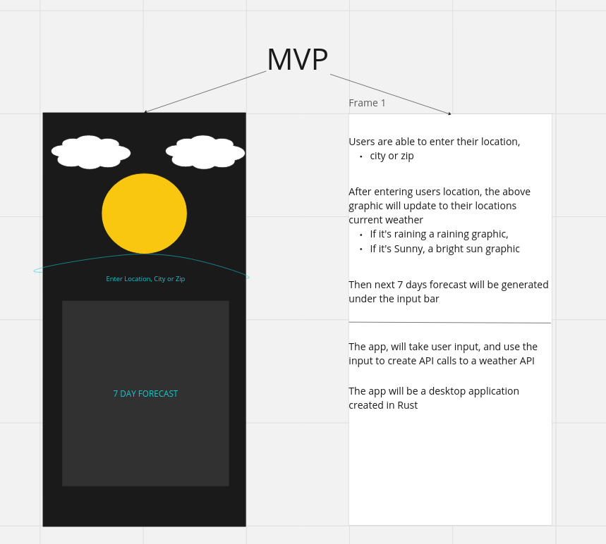
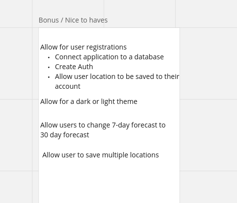

# Weather App in Rust --- WIP

## Introduction
This weather app is designed as a learning project to further my skills in the Rust programming language. It's a simple, yet functional app that provides current weather information.

## Purpose
The purpose of this project is to progress my learning in the Rust programming language, understand API interaction, and handle JSON data in a type-safe manner.

## MVP


## Bonus


## Features
- Fetch and display current weather data
- Customizable location input

## Prerequisites
Before you begin, ensure you have met the following requirements:
- Rust programming environment set up
- Basic understanding of Rust and command-line operations

## Forking the Project
To contribute or modify the project, start by forking the repository:

1. Navigate to the main page of the repository.
2. In the top-right corner of the page, click **Fork**.

## Installation
To install the weather app, follow these steps:

1. Clone the forked repository to your local machine:
```bash
    git clone https://github.com/AdrianRRojo/weather-app-rust.git
```
2. Navigate to the cloned directory:
```bash
    cd weather-app-rust
```
3. Build the project using Cargo (the Rust package manager):

```bash

    cargo build 
```

4. Running the App:
```bash
    cargo run
```


Checkout my portfolio:
    <a href="https://adrirojo.vercel.app" target=_blank>adrirojo.vercel.app</a>